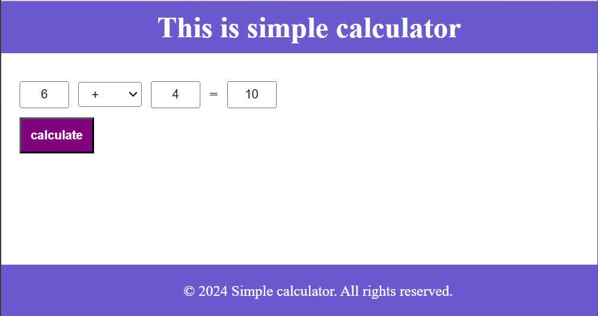
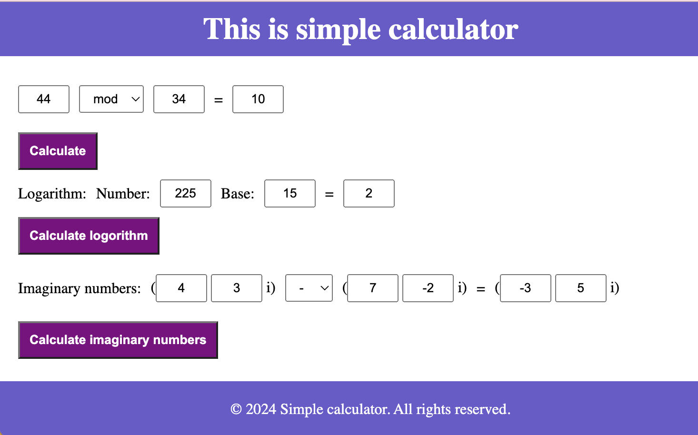
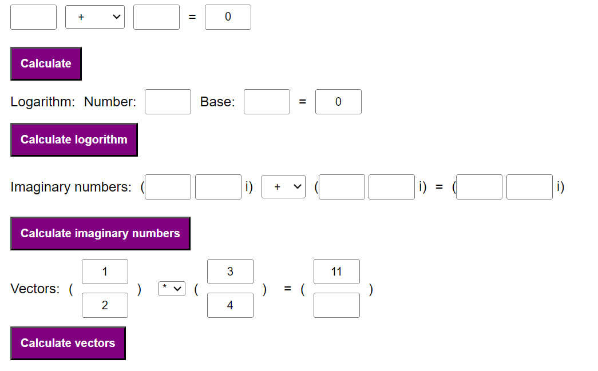

# WebCodeKitchen

## Simple calculator

This program handles simple calculation functions such as +,-,*,/,mod and ^.

Here we added a possibility to calculate logarithm and imaginary numbers.

Here we have added possible operations with vectors.