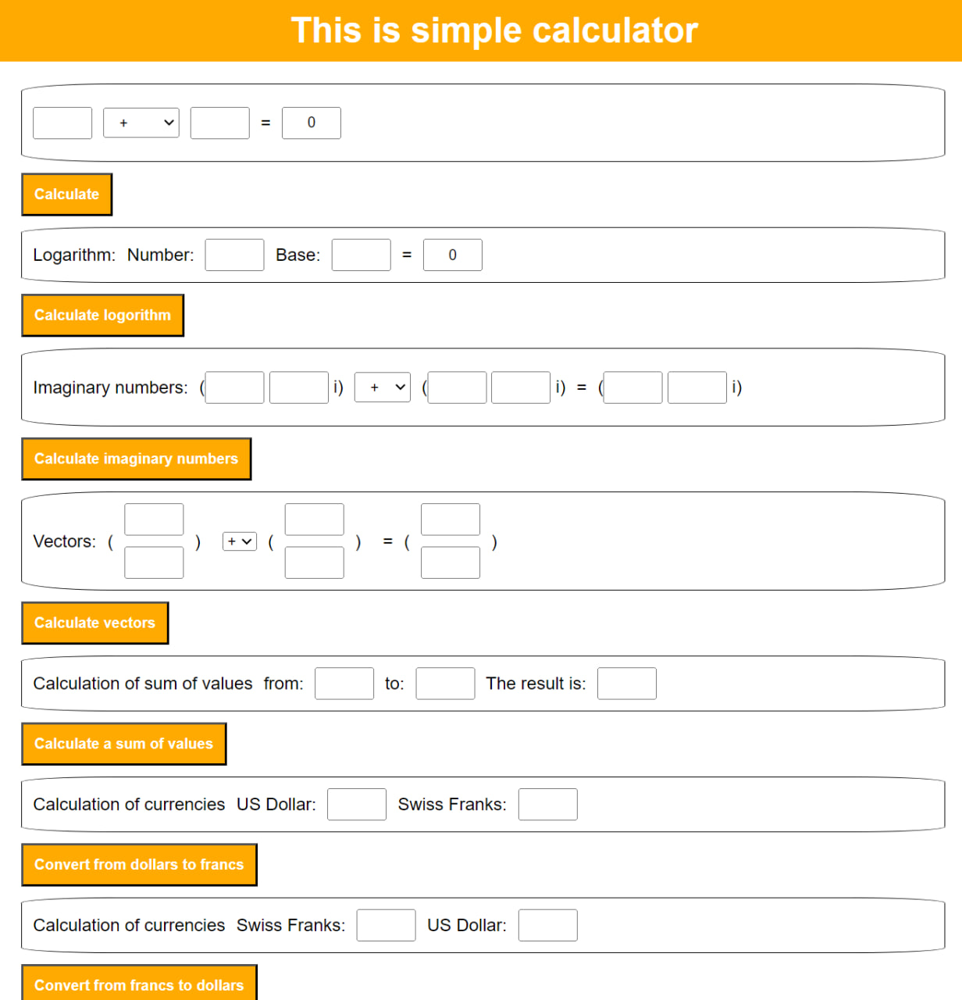

# WebCodeKitchen

## Simple calculator

This program handles simple calculation functions such as +,-,*,/,mod and ^.

Here we added a possibility to calculate logarithm and imaginary numbers.

Here we have added possible operations with vectors.

Here is link to test it - https://sergeymoshtakov.github.io/WebCodeKitchen/SimpleCalculator/

The final version of simple calculator.

